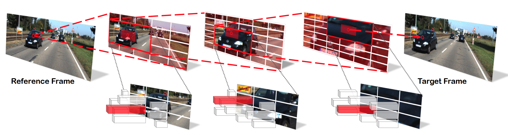

# HD3

This is a PyTorch implementation (in progress) of our paper:

Hierarchical Discrete Distribution Decomposition for Match Density Estimation (CVPR 2019)

[Zhichao Yin](http://zhichaoyin.me/), [Trevor Darrell](https://people.eecs.berkeley.edu/~trevor/), [Fisher Yu](https://www.yf.io/)

arxiv preprint (updated camera-ready version): (https://arxiv.org/abs/1812.06264)

## TODO
- Full training and evaluation code in one week.
